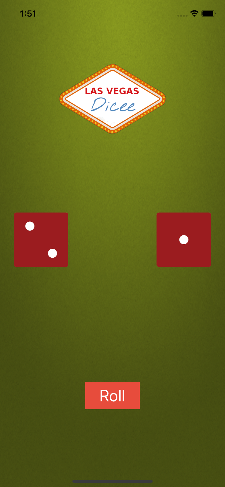

# Dice Game
A Basic Dice Game Application generating Random Numbers and showing Different faces accordingly

## Topics I have learned

* How to add constraints and understanding how Auto Layout works.
* How to Pin and Align elements.
* How to create containers to configure advanced layouts.
* How to debug auto layout errors.
* Understanding what Xcode needs in order to correctly layout a design.
* How to use Stack Views to create complex interfaces.

## Screenshot
 
